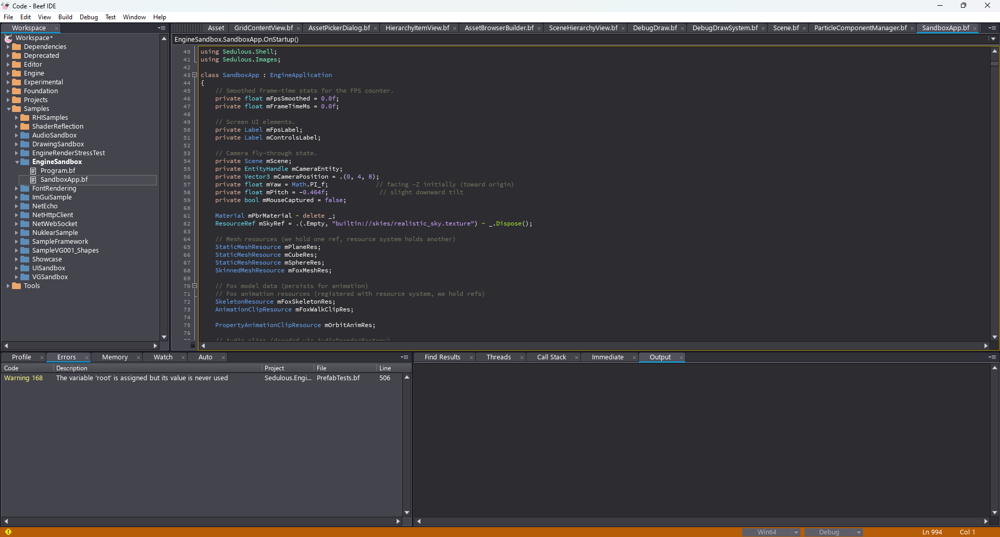
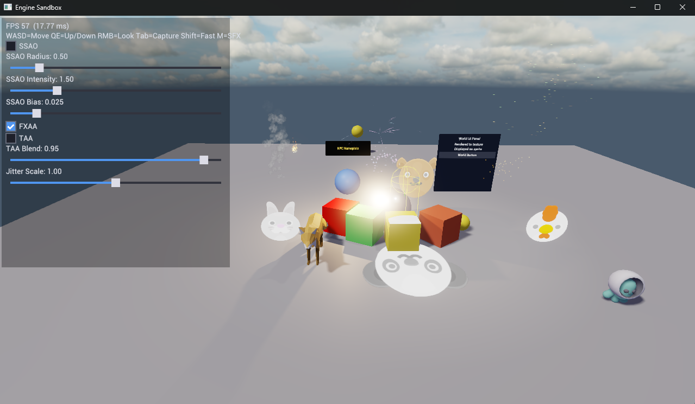
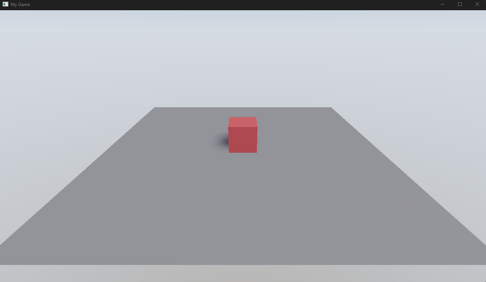

# Getting Started

Sedulous is a code-first engine -- you build scenes, entities, and game logic entirely in code. No editor is required. This guide walks through creating your first application: a window with a 3D scene, a camera, and a lit object.

## Prerequisites

Before you begin, install the following:

### BeefIDE

Sedulous is written in [Beeflang](https://www.beeflang.org/). Download and install the latest nightly build from [nightly.beeflang.org](https://nightly.beeflang.org/index.html). The nightly includes the compiler, debugger, and IDE with the latest language features and fixes that Sedulous depends on.

### Vulkan SDK (recommended)

If using the Vulkan backend (recommended), install the [Vulkan SDK](https://vulkan.lunarg.com/sdk/home) from LunarG. Minimum Vulkan 1.3 required. The SDK provides the Vulkan loader, validation layers, and shader tools.

After installation, verify Vulkan 1.3+ is available by running `vulkaninfo` from a terminal.

> **Note:** The DX12 backend is also available on Windows but Vulkan is recommended for development as it provides better validation layer diagnostics.

### Engine Workspace

Clone the Sedulous engine repository:

```
git clone https://github.com/SedulousWorks/SedulousEngine.git
```

Open the workspace in BeefIDE:

1. Launch BeefIDE
2. File > Open > Open Workspace
3. Select `SedulousEngine/Code/` folder (which contains `BeefSpace.toml`)

The workspace contains all engine libraries, dependencies, and samples organized in workspace folders. The solution explorer (left panel) shows the project tree.



To verify everything works, set the startup project to `EngineSandbox` (right-click > Set as Startup Project in the solution explorer) and press F5 to build and run. You should see a 3D scene with a lit cube, animated fox, and particle effects.



The samples (`EngineSandbox`, `Showcase`, `TowerDefense`) are good starting points to study.

## Creating a New Project

Your game project lives inside the Sedulous workspace. The recommended location is `SedulousEngine/Code/Samples/MyGame` (or wherever you prefer under the workspace).

1. In BeefIDE, right-click the workspace root in the solution explorer
2. Select **Add New Project**
3. Name it (e.g., `MyGame`), set Target Type to **Console Application**
4. Choose a location (e.g., `Samples/MyGame`)
5. The project is created with a `BeefProj.toml` and a `src/` folder

### Dependencies

Add the engine dependencies to your project:

1. Right-click your project (e.g., `MyGame`) in the solution explorer
2. Select **Properties**
3. Go to the **Dependencies** tab
4. Tick the following:

- `Sedulous.Engine.App`
- `Sedulous.Images.STB`

`Sedulous.Engine.App` pulls in everything else transitively (RHI backends, rendering, scene system, physics, audio, mathematics, resources, etc.). You only need to explicitly add libraries that aren't already dependencies of `Engine.App` -- in this case, `Images.STB` for the image loader.

### Assets Directory

The engine discovers an `Assets` folder by searching upward from the working directory. The folder must contain a `.assets` marker file. The engine's own `SedulousEngine/Assets/` directory already has this -- your project uses it automatically when run from within the workspace.

## Creating Source Files

Create two source files in your project:

1. Right-click your project (e.g., `MyGame`) in the solution explorer
2. Select **Add File**
3. Enter `Program` as the class name -- this creates `src/Program.bf`
4. Repeat and enter `MyGameApp` -- this creates `src/MyGameApp.bf`

### MyGameApp.bf

The engine uses `EngineApplication` as the base class for all applications. Override its lifecycle methods to configure and run your game.

```beef
using Sedulous.Engine.App;

namespace MyGame;

class MyGameApp : EngineApplication
{
    protected override void OnStartup()
    {
        // Set up your scene here
    }
}
```

### Program.bf

The entry point creates and runs the application with settings:

```beef
using System;

namespace MyGame;

class Program
{
    static int Main(String[] args)
    {
        let app = scope MyGameApp();
        return app.Run(.() {
            Title = "My Game",
            Width = 1280,
            Height = 720
        });
    }
}
```

## Application Lifecycle

`EngineApplication` provides these virtual methods, called in order:

| Method | When | Purpose |
|--------|------|---------|
| `OnConfigure(Context)` | Before subsystem startup | Register custom subsystems |
| `OnStartup()` | After all subsystems initialized | Create scenes, load resources, set up entities |
| `OnUpdate(float deltaTime)` | Every frame | Game logic |
| `OnShutdown()` | Before cleanup | Release resources |

The engine handles device creation, swap chain, frame pacing, and presentation automatically. You don't need to manage the render loop.

The engine manages a set of subsystems (rendering, physics, audio, etc.) that you can access when needed:

```beef
let sceneSub = Context.GetSubsystem<SceneSubsystem>();
let audioSub = Context.GetSubsystem<AudioSubsystem>();
```

For details on the subsystem architecture and how to create your own, see [Engine Architecture](11_EngineArchitecture.md).

## Initializing Image Loaders

Before loading any textures or models, register at least one image loader. This is typically done at the start of `OnStartup()`:

```beef
using Sedulous.Images.STB;

protected override void OnStartup()
{
    STBImageLoader.Initialize();
    // ...
}
```

STB handles `.png`, `.jpg`, `.tga`, `.bmp`, and `.hdr` formats. For additional format support, add `Sedulous.Images.SDL`:

```beef
using Sedulous.Images.SDL;

SDLImageLoader.Initialize();
```

## Creating a Scene

Scenes are created through the `SceneSubsystem`. Each scene gets its own set of component managers, injected automatically by engine subsystems (rendering, physics, animation, etc.) via the `ISceneAware` interface.

Add the following inside `MyGameApp.OnStartup()`, after the image loader initialization:

```beef
let sceneSub = Context.GetSubsystem<SceneSubsystem>();
mScene = sceneSub.CreateScene("Main");
```

You'll also need these usings at the top of `MyGameApp.bf`:

```beef
using Sedulous.Engine.Core;
using Sedulous.Engine;
```

And add a field to store the scene: `private Scene mScene;`

All the code in the following sections goes inside `OnStartup()` after the scene is created. The usings shown with each snippet go at the top of the file.

## Creating Entities

Entities are lightweight handles in the scene. They have a transform (position, rotation, scale) and can hold components. You create them via `mScene.CreateEntity()` and set their transform with `mScene.SetLocalTransform()`.

We'll create our first entities in the sections below -- a camera, a light, and meshes.

## Adding a Camera

Every scene needs at least one camera to render. Create an entity, then add a `CameraComponent` via the camera manager (add `using Sedulous.Engine.Render;` at the top):

```beef
let cam = mScene.CreateEntity("Camera");
mScene.SetLocalTransform(cam, Transform.CreateLookAt(.(0, 4, 8), .(0, 0, 0)));
let cameraMgr = mScene.GetModule<CameraComponentManager>();
if (let c = cameraMgr.Get(cameraMgr.CreateComponent(cam)))
{
    c.IsActive = true;
    c.FieldOfView = 60;
}
```

## Adding a Light

Without a light, the scene renders black. Add a directional light (add `using Sedulous.Core.Mathematics;` at the top for `Quaternion`):

```beef
let sun = mScene.CreateEntity("Sun");
mScene.SetLocalTransform(sun, .() {
    Position = .(0, 10, 0),
    Rotation = Quaternion.CreateFromYawPitchRoll(0.5f, -1.0f, 0),
    Scale = .One
});
let lightMgr = mScene.GetModule<LightComponentManager>();
if (let l = lightMgr.Get(lightMgr.CreateComponent(sun)))
{
    l.Type = .Directional;
    l.Intensity = 1.5f;
    l.CastsShadows = true;
}
```

## Adding Meshes

To display 3D objects, create mesh resources and attach them to entities via `MeshComponentManager`. Add `using Sedulous.Geometry.Resources;` and `using Sedulous.Resources;` at the top.

First, a ground plane:

```beef
let planeRes = StaticMeshResource.CreatePlane(10, 10, 1, 1);
defer planeRes.ReleaseRef();
ResourceSystem.AddResource<StaticMeshResource>(planeRes);
let ground = mScene.CreateEntity("Ground");
let meshMgr = mScene.GetModule<MeshComponentManager>();
if (let m = meshMgr.Get(meshMgr.CreateComponent(ground)))
{
    var r = ResourceRef(planeRes.Id, .());
    defer r.Dispose();
    m.SetMeshRef(r);
}
```

Then a cube sitting on it:

```beef
let cubeRes = StaticMeshResource.CreateCube();
defer cubeRes.ReleaseRef();
ResourceSystem.AddResource<StaticMeshResource>(cubeRes);
let cube = mScene.CreateEntity("Cube");
mScene.SetLocalTransform(cube, .() {
    Position = .(0, 0.5f, 0), Rotation = .Identity, Scale = .One
});
if (let m = meshMgr.Get(meshMgr.CreateComponent(cube)))
{
    var r = ResourceRef(cubeRes.Id, .());
    defer r.Dispose();
    m.SetMeshRef(r);
}
```

Components reference resources via `ResourceRef` -- a GUID + path pair. For programmatic resources (created in code and added via `ResourceSystem.AddResource`), use the resource's GUID with an empty path: `ResourceRef(resource.Id, .())`. For file-based resources, use the protocol path: `ResourceRef(.Empty, "project://models/hero.mesh")`.

`ResourceRef` owns a heap-allocated string, so it needs to be disposed when you're done. The `defer` pattern handles this. The component's `SetMeshRef` makes its own copy, so the original can be disposed immediately.

Meshes without an explicit material use a default white PBR material. The cube will appear as a white lit surface.

## Adding Materials

To give objects color, create a base PBR material and material instances. Add `using Sedulous.Materials;` at the top.

First, add fields to `MyGameApp` for lifetime management:

```beef
Material mPbrMaterial ~ delete _;
MaterialInstance mGroundMaterial ~ _?.ReleaseRef();
MaterialInstance mCubeMaterial ~ _?.ReleaseRef();
```

Then after the mesh setup code, create the materials and assign them:

```beef
let renderSub = Context.GetSubsystem<RenderSubsystem>();
let matSystem = renderSub.RenderContext.MaterialSystem;

mPbrMaterial = Materials.CreatePBR("PBR", "forward",
    matSystem.WhiteTexture, matSystem.DefaultSampler);

mGroundMaterial = new MaterialInstance(mPbrMaterial);
mGroundMaterial.SetColor("BaseColor", .(0.4f, 0.4f, 0.4f, 1));

mCubeMaterial = new MaterialInstance(mPbrMaterial);
mCubeMaterial.SetColor("BaseColor", .(0.9f, 0.2f, 0.2f, 1));
mCubeMaterial.SetFloat("Roughness", 0.5f);
```

Assign them to the mesh components using `SetMaterial`:

```beef
if (let m = meshMgr.GetForEntity(ground))
    m.SetMaterial(0, mGroundMaterial);

if (let m = meshMgr.GetForEntity(cube))
    m.SetMaterial(0, mCubeMaterial);
```

The base `Material` is owned by the app and deleted on shutdown. `MaterialInstance` is ref-counted -- the field destructor calls `ReleaseRef()`. `SetMaterial` on the component AddRefs the instance, so both the component and the app hold a ref.

## Setting Up Render Settings

Scene-level render settings (ambient light, exposure) are configured via `RenderSceneModule`:

```beef
if (let rs = mScene.GetModule<RenderSceneModule>())
{
    rs.AmbientColor = .(0.1f, 0.1f, 0.15f);
    rs.Exposure = 1.0f;
}
```

## Complete Example

Putting it all together -- here's what your two files should look like:

### MyGameApp.bf

```beef
using System;
using Sedulous.Engine.App;
using Sedulous.Engine.Core;
using Sedulous.Engine.Render;
using Sedulous.Engine;
using Sedulous.Core.Mathematics;
using Sedulous.Geometry.Resources;
using Sedulous.Resources;
using Sedulous.Materials;
using Sedulous.Images.STB;

namespace MyGame;

class MyGameApp : EngineApplication
{
    private Scene mScene;
    private Material mPbrMaterial ~ delete _;
    private MaterialInstance mGroundMaterial ~ _?.ReleaseRef();
    private MaterialInstance mCubeMaterial ~ _?.ReleaseRef();

    protected override void OnStartup()
    {
        STBImageLoader.Initialize();

        let sceneSub = Context.GetSubsystem<SceneSubsystem>();
        mScene = sceneSub.CreateScene("Main");

        // Camera
        let cam = mScene.CreateEntity("Camera");
        mScene.SetLocalTransform(cam, Transform.CreateLookAt(.(0, 4, 8), .(0, 0, 0)));
        let cameraMgr = mScene.GetModule<CameraComponentManager>();
        if (let c = cameraMgr.Get(cameraMgr.CreateComponent(cam)))
        {
            c.IsActive = true;
            c.FieldOfView = 60;
        }

        // Light
        let sun = mScene.CreateEntity("Sun");
        mScene.SetLocalTransform(sun, .() {
            Position = .(0, 10, 0),
            Rotation = Quaternion.CreateFromYawPitchRoll(0.5f, -1.0f, 0),
            Scale = .One
        });
        let lightMgr = mScene.GetModule<LightComponentManager>();
        if (let l = lightMgr.Get(lightMgr.CreateComponent(sun)))
        {
            l.Type = .Directional;
            l.Intensity = 1.5f;
            l.CastsShadows = true;
        }

        // Materials
        let renderSub = Context.GetSubsystem<RenderSubsystem>();
        let matSystem = renderSub.RenderContext.MaterialSystem;

        mPbrMaterial = Materials.CreatePBR("PBR", "forward",
            matSystem.WhiteTexture, matSystem.DefaultSampler);

        mGroundMaterial = new MaterialInstance(mPbrMaterial);
        mGroundMaterial.SetColor("BaseColor", .(0.4f, 0.4f, 0.4f, 1));

        mCubeMaterial = new MaterialInstance(mPbrMaterial);
        mCubeMaterial.SetColor("BaseColor", .(0.9f, 0.2f, 0.2f, 1));
        mCubeMaterial.SetFloat("Roughness", 0.5f);

        // Ground plane
        let planeRes = StaticMeshResource.CreatePlane(10, 10, 1, 1);
        defer planeRes.ReleaseRef();
        ResourceSystem.AddResource<StaticMeshResource>(planeRes);
        let ground = mScene.CreateEntity("Ground");
        let meshMgr = mScene.GetModule<MeshComponentManager>();
        if (let m = meshMgr.Get(meshMgr.CreateComponent(ground)))
        {
            var r = ResourceRef(planeRes.Id, .());
            defer r.Dispose();
            m.SetMeshRef(r);
            m.SetMaterial(0, mGroundMaterial);
        }

        // Cube
        let cubeRes = StaticMeshResource.CreateCube();
        defer cubeRes.ReleaseRef();
        ResourceSystem.AddResource<StaticMeshResource>(cubeRes);
        let cube = mScene.CreateEntity("Cube");
        mScene.SetLocalTransform(cube, .() {
            Position = .(0, 0.5f, 0), Rotation = .Identity, Scale = .One
        });
        if (let m = meshMgr.Get(meshMgr.CreateComponent(cube)))
        {
            var r = ResourceRef(cubeRes.Id, .());
            defer r.Dispose();
            m.SetMeshRef(r);
            m.SetMaterial(0, mCubeMaterial);
        }

        // Render settings
        if (let rs = mScene.GetModule<RenderSceneModule>())
        {
            rs.AmbientColor = .(0.1f, 0.1f, 0.15f);
            rs.Exposure = 1.0f;
        }
    }
}
```

### Program.bf

```beef
using System;

namespace MyGame;

class Program
{
    static int Main(String[] args)
    {
        let app = scope MyGameApp();
        return app.Run(.() {
            Title = "My Game",
            Width = 1280,
            Height = 720
        });
    }
}
```

Set your project as the startup project (right-click > Set as Startup Project) and press F5. You should see a red cube sitting on a gray ground plane, lit by a directional light with shadows. The camera looks down at the scene from an angle.

> **Note:** The first run may be slow due to shader compilation. Subsequent runs use cached shaders and start much faster.



From here, try changing values -- move the cube, change the light color, add more entities. The samples in the workspace (`EngineSandbox`, `Showcase`) demonstrate more advanced features.

## Next Steps

- [Scenes and Entities](01_ScenesAndEntities.md) -- entity hierarchy, transforms, component lifecycle
- [Resources](02_Resources.md) -- loading meshes, textures, materials from files
- [Rendering](03_Rendering.md) -- cameras, lights, materials, post-processing
